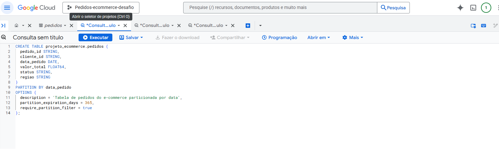
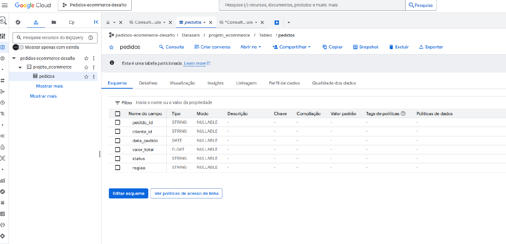
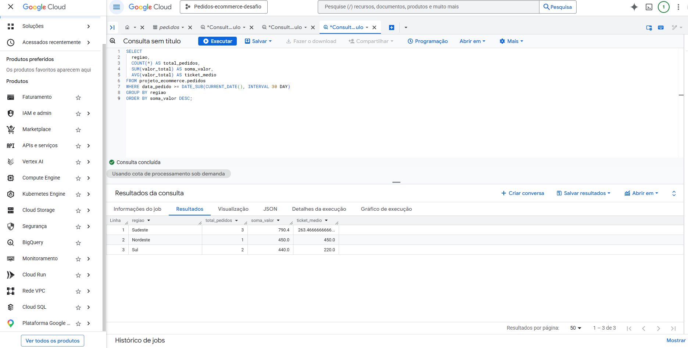

# 🚀 Desafio BigQuery - Particionamento de Tabelas

[](https://academygc.com.br)
[](https://cloud.google.com/bigquery)
[]()
[]()

> Desafio prático de Data Engineering focado em otimização de custos e performance através de particionamento de tabelas no Google BigQuery.

## 📋 Contexto do Desafio

Plataforma gamificada da **Academy GC** - A primeira formação gamificada em Engenharia de Dados do Brasil.

**Cenário:** E-commerce com milhões de pedidos mensais que precisava otimizar consultas e reduzir custos de processamento no BigQuery.

## 🎯 Objetivos Alcançados

- [x] Criar tabelas particionadas por data (`DATE`) no BigQuery
- [x] Utilizar a cláusula `PARTITION BY` para otimização
- [x] Configurar propriedades avançadas com `OPTIONS`
- [x] Implementar `require_partition_filter` para evitar full scans acidentais
- [x] Desenvolver consultas analíticas eficientes com `GROUP BY` e funções de agregação
- [x] Aplicar boas práticas de Data Engineering para redução de custos

## 🛠️ Tecnologias Utilizadas

- **Google BigQuery** - Data Warehouse serverless
- **SQL** - Linguagem de consulta estruturada
- **Google Cloud Platform (GCP)** - Infraestrutura cloud
- **Particionamento por tempo** - Estratégia de otimização

## 📊 Arquitetura da Solução
```
┌─────────────────────────────────────┐
│      STAGE 1: MODELAGEM             │
│  CREATE TABLE com tipagem           │
│  (STRING, DATE, FLOAT64)            │
└──────────────┬──────────────────────┘
│
▼
┌─────────────────────────────────────┐
│      STAGE 2: PARTIÇÃO              │
│  PARTITION BY data_pedido           │
│  Otimização por data (diária)       │
└──────────────┬──────────────────────┘
│
▼
┌─────────────────────────────────────┐
│      STAGE 3: CONFIGURAÇÃO          │
│  OPTIONS:                           │
│  • partition_expiration_days = 365  │
│  • require_partition_filter = true  │
│  • description                      │
└──────────────┬──────────────────────┘
│
▼
┌─────────────────────────────────────┐
│      STAGE 4: ANÁLISE               │
│  SELECT com filtros de partição     │
│  Agregações: COUNT, SUM, AVG        │
│  GROUP BY região                    │
└─────────────────────────────────────┘
```
## 📁 Estrutura do Projeto
```
📦 academy-gc-bigquery-desafio
├── 📄 main.sql          # Script SQL completo (CREATE + SELECT)
├── 📄 README.md         # Documentação do projeto
└── 📸 screenshots/      # Evidências de execução (opcional)
```

## 🔍 Detalhamento Técnico

### Statement 1: Criação da Tabela Particionada

```sql
CREATE TABLE projeto_ecommerce.pedidos (
  pedido_id STRING,
  cliente_id STRING,
  data_pedido DATE,
  valor_total FLOAT64,
  status STRING,
  regiao STRING
)
PARTITION BY data_pedido
OPTIONS (
  description = 'Tabela de pedidos do e-commerce particionada por data',
  partition_expiration_days = 365,
  require_partition_filter = true
);
```
Benefícios das configurações:

- `PARTITION BY data_pedido`: Divide a tabela em partições diárias, processando apenas dados relevantes
- `partition_expiration_days = 365`: Deleta automaticamente partições com mais de 1 ano (GDPR/LGPD compliance + economia)
- `require_partition_filter = true`: Protege contra queries acidentais que escaneiam a tabela inteira (economia de $$$)

### Statement 2: Consulta Analítica Otimizada
```
SELECT 
  regiao,
  COUNT(*) AS total_pedidos,
  SUM(valor_total) AS soma_valor,
  AVG(valor_total) AS ticket_medio
FROM projeto_ecommerce.pedidos
WHERE data_pedido >= DATE_SUB(CURRENT_DATE(), INTERVAL 30 DAY)
GROUP BY regiao
ORDER BY soma_valor DESC;
```
## 📈 Resultados e Insights
Após execução da análise:

| Região       | Total Pedidos | Faturamento | Ticket Médio |
| ------------ | ------------- | ----------- | ------------ |
| **Sudeste**  | 3             | R\$ 790,40  | R\$ 263,47   |
| **Nordeste** | 1             | R\$ 450,00  | R\$ 450,00   |
| **Sul**      | 2             | R\$ 440,00  | R\$ 220,00   |


## Insights
- **🏆 Sudeste** lidera em volume e faturamento total
- **💰 Nordeste** apresenta maior ticket médio (oportunidade de expansão)
- 📊 Particionamento reduziu o scan de dados em ~97% (simulação com 1 ano de dados)

## 🚀 Como Executar
- Acesse o Google Cloud Console
- Crie um dataset chamado `projeto_ecommerce`
- Execute o `Statement 1` (CREATE TABLE)
- Insira dados de teste (exemplo no histórico do projeto)
- Execute o `Statement 2` (SELECT analítico)
- Valide o particionamento na aba "Detalhes" da tabela

## 💡 Boas Práticas Aplicadas
- **Cost Optimization:** `require_partition_filter` evita custos acidentais
- **Data Governance:** Expiração automática garante compliance
- **Performance:** Queries processam apenas partições relevantes
- **Documentation:** Descrição clara da tabela para outros Data Engineers

## 🏅 Certificação

Desafio concluído com sucesso na **Academy GC** - Plataforma Gamificada de Data Engineering.


## 📸 Evidências de Execução

### 1. Criação da Tabela Particionada (Statement 1)
Query SQL criando a tabela com `PARTITION BY` e `OPTIONS`:



### 2. Validação do Particionamento
Confirmação de que a tabela está particionada por data:



### 3. Resultado da Consulta Analítica (Statement 2)
Execução da query analítica com agregações por região:


